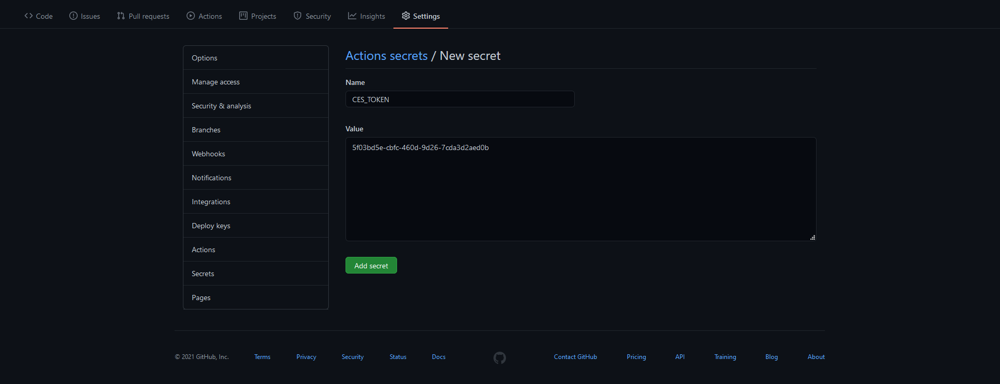

# Code Pipeline Promote

The Code Pipeline Promote action allows your GitHub Actions workflow to trigger a promote in your instance of BMC AMI DevX Code Pipeline on the mainframe. This action can be used when you want your GitHub Actions workflow to operate on source that is already stored in Code Pipeline.

## Templates
Create a GitHub workflow file, for example, [code-pipeline-promote.yml](.github/templates/code-pipeline-promote.yml) the workflow is broken up into the following stages:
- Promote Task in Assignment using component level
- Promote Task in Assignment using component name and component type
- Promote Task in Release using component level
- Promote Task in Release using component name and component type

## Example usage

``` yaml
on: [push]


jobs:

  codepipeline-promote-1:
    name: Promote task in Assignment using level
    runs-on: [self-hosted, codepipeline-win]
    steps:
      - name: Promote
        uses: bmc-compuware/code-pipeline-promote@v1.0
        id: promote
        with:
          ces_url: "http://ces-ws:48080/"
          ces_token: ${{ secrets.CES_TOKEN }}
          srid: ispw
          runtime_configuration: TPTP
          container_type: A
          container_id: PLAY000001
          level: DEV1
      - name: Get the SET ID for the promote
        run: echo "The Code Pipeline SET used for the promote is ${{ steps.promote.outputs.set_id }}"
  
  codepipeline-promote-2:
    name: Promote task in Assignment using component name and type
    runs-on: [self-hosted, codepipeline-win]
    steps:
      - name: Promote
        uses: bmc-compuware/code-pipeline-promote@v1.0
        id: promote
        with:
          ces_url: "http://ces-ws:48080/"
          ces_token: ${{ secrets.CES_TOKEN }}
          srid: ispw
          runtime_configuration: TPTP
          container_type: A
          container_id: PLAY000001
          level: STG1
          mname: TREXX04
          mtype: CLST
      - name: Get the SET ID for the promote
        run: echo "The Code Pipeline SET used for the promote is ${{ steps.promote.outputs.set_id }}"

  codepipeline-promote-3:
    name: Promote task in Release using level
    runs-on: [self-hosted, codepipeline-win]    
    steps:
      - name: Promote
        uses: bmc-compuware/code-pipeline-promote@v1.0
        id: promote
        with:
          ces_url: "http://ces-ws:48080/"
          ces_token: ${{ secrets.CES_TOKEN }}
          srid: ispw
          runtime_configuration: TPTP
          container_type: R
          container_id: PRMTEST
          level: DEV2
      - name: Get the SET ID for the promote
        run: echo "The Code Pipeline SET used for the promote is ${{ steps.promote.outputs.set_id }}"
  
  codepipeline-promote-4:
    name: Promote task in Release using component name and type
    runs-on: [self-hosted, codepipeline-win]    
    steps:
      - name: Promote
        uses: bmc-compuware/code-pipeline-promote@v1.0
        id: promote
        with:
          ces_url: "http://ces-ws:48080/"
          ces_token: ${{ secrets.CES_TOKEN }}
          srid: ispw
          runtime_configuration: TPTP
          container_type: R
          container_id: PRMTEST
          level: STG2
          mname: TPROG09
          mtype: C0B
      - name: Get the SET ID for the promote
        run: echo "The Code Pipeline SET used for the promote is ${{ steps.promote.outputs.set_id }}"
```

## Inputs

| Input name | Required | Description |
| ---------- | -------- | ----------- |
| `ces_url` | Required | The CES url. |
| `ces_token` | Required | The token to use while connecting to BMC AMI DevX Code Pipeline via CES. |
| `srid` | Required | The ID of the instance of BMC AMI DevX Code Pipeline to connect to. |
| `container_type` | Required | The container type for which you intend to promote tasks. The container type can be either A or R. |
| `container_id` | Required | The container id for which you intend to promote tasks. |
| `level` | Required | The level that the tasks exist at in the assignment. |
| `mname` | Optional | Component with this name in the container will be promoted. You must additionally give the mtype if you specified the mname.|
| `mtype` | Optional | Component with this type in the container will be promoted. |
| `runtime_configuration` | Optional | The runtime configuration used when connecting to BMC AMI DevX Code Pipeline. |
| `change_type` | Optional | The change type of this request. S for standard, I for incidental, or E for emergency. Default value is S |
| `execution_status` | Optional | The flag to indicate whether the generate should happen immediately, or should be held. The default is 'I'. |
| `auto_deploy` | Optional | Generates can be set up to automatically Deploy as well by an option set up by the Code Pipeline. The default is to not use Auto Deploy i.e. false. If the Auto Deploy option is set-up through Code Pipeline, then you may use this option to automatically deploy. Possible values are true or false. |
| `dpenvlst` | Optional | The DPENVLST parameter allows you to override the environments configured for deploy at that level. If you wish to deploy to only certain environments, you can list them here, separated by a space. The length of the field is limited to 255. |
| `system` | Optional | Allows you to specify a specific System for the Deploy. |
| `override` | Optional | Specify true to override a higher version of the task during promote. Use with caution. |

## Outputs

| Output name | Output type | Description |
| ----------- | ----------- | ----------- |
| `is_timed_out` | boolean | Whether the promote timed out. A time out would indicate that the promote has not completed and may still be running. |
| `set_id` | string | The id of the SET that was used for processing. |
| `url` | string | The URL that can be used to retrieved information about the set that was used for processing. |
| `output_json` | JSON | the JSON output from Promote. |

## Setup

### Create a token in Common Enterprise Services (CES)

In order to use this action, you must have an instance of the CES product installed on one of your runners. Once that is complete, you will need to open CES in your web browser and create a token to be used during requests. 

To set up a new host connection, go to the **Administration** menu in the upper left corner and select **Host connections**.


On the Host Connection Settings page, click **Add**. Set up the host connection to be used for Code Pipeline and click **Save** when finished.


Then, go back to the menu and select **Security**. 


On the Security page, click **Add** and the **Personal Access Token dialog** will come up.


On the Personal Access Token dialog, select the host that you want to create a token for, and enter in the mainframe **username** and **password**.

Once done, there will be a new token in the table on the Security page


### Save the token as a GitHub Secret

From the Security page in CES, copy the token. In GitHub go to Settings > Secrets and click the button for New Repository Secret.


On the New Secret page, paste the token that was copied earlier and click the Add secret button. Make a note of the name you give the secret so that you can easily use it in your workflow script.



### Troubleshooting

To enable debug logging in your GitHub actions workflow, see the guide [here](https://docs.github.com/en/actions/managing-workflow-runs/enabling-debug-logging).

## See also
- [License](LICENSE.txt)